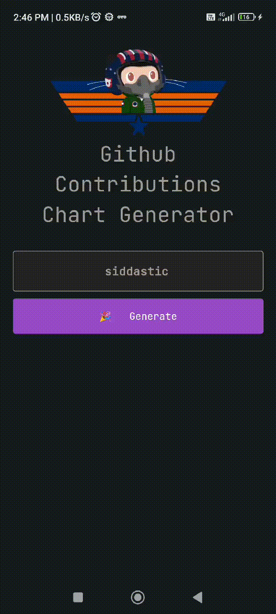

# Github Contributions Flutter

Heavily Inspired by [github-contributions-chart](https://github.com/sallar/github-contributions-chart)

A Flutter widget to display a GitHub contributions chart. (Made for an Assignment)



## Usage

Enter your GitHub username and the widget will display your contributions chart.

## API

This project uses the below api to fetch the contributions data.

```bash
https://github-contributions.vercel.app/api/v1/${widget.username}
```

## Demo App

You can download the demo app from [here]().